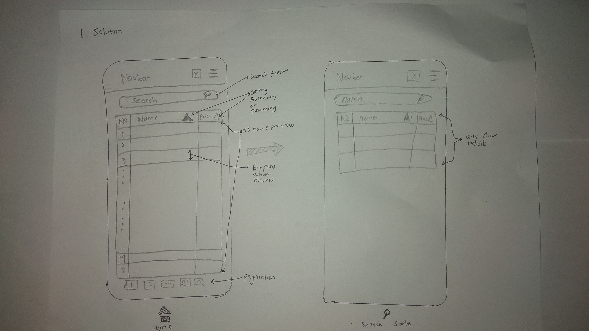

# Sketching and Prototyping
Using the information in the results of Assignment 1 for what is good and bad about the UI for designed tasks, we are going to make **Sketches** and **Prototypes**. These sketches and prototypes will lead to better design in Assignment 3. The prototypes will be then tested through a usability evaluation followed by design revision in Assignment 4.

## Part A: Sketches
Sketch at least **3 (three)** different UIs for the functions you are targeting. These three interfaces should be _dramatically different_ in terms of design directions. For example, they can be with different organizations of what functions on each screen or using a different layout of the icons, widgets, and menus on the screens. If you want, you can also incorporate non-on-screen UIs: physical buttons, gestures through motion sensors, etc.

You need **not** sketch the whole interface. It is not necessary for the sketches to have every function or every function in detail, but there should be enough to show off your general idea. **Be creative!** Draw your idea and label a few of the widgets so we can tell your intent. The goal is to have at least 3 good UIs in *interesting* ways. Sketches should be done on paper with pens and/or pencils (do not use a computer).

### 1. Scan/Photo of Sketches
##### 1.1 Original


##### 1.2 Solution 1


##### 1.3 Solution 2


##### 1.4 Solution 3


### 2. Version Differences
#### 2.1 Original
1. Plenty row in one view table.
1. No sorting row.
1. Need swipe to see another column.
1. Too long name or tittle.
##### 2.2 Solution 1
1. Search Feature for searching spesific data,and give result
in table form.
1. Give only 15 rows per view.
1. Sorting in Header row.
1. Expand row when clicked.
1. Pegination.

#### 2.3 Solution 2
1. Not in Table usually form.
1. Give only 15 rows per view.
1. Make search,filter,and sort in bottom side view.
1. Search Feature.
1. Filter by price.
1. give sorting feature.
1. Expand row when clicked.
1. Pegination.

#### 2.4 Solution 3
1. Search feature.
1. Expand row when clicked.
1. Pegination.
1. Give advance setting that collect all setting,that appear when setting icon clicked:
filter setting,sort by price or name,
display how many row per view.All setting can 
use together.

### 3. Selected Sketch
Select solution 3, because more simple and display data
not in usually boring table.

### 4. Design Rationale
Designer must make user more efficent to get their data.And Think about user comfortabillity

## Part B: Assumptions
### 1. Hardware
- Operating System : Android
- Physical Input : touchscreen
- Screen Resolution : 1024 x 768 or higher
- Screen Size : 5'5 inch
- Screen Color : RGB

### 2. Users
```
1  Expected as educated local citizens.
2. Familiar with internet or technology.
3. Familiar using mobile web browser.
4. Age : 20 - 50 years old.
```

## Part C: Prototypes
1. 
1. 
1. 
1. 

